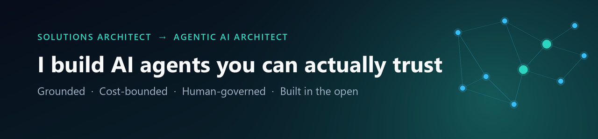

  

# Hello..!!👋

> Two decades architecting enterprise systems. Now pointed at one question:
> **how do you make autonomous AI dependable in production?**

Not prompts with ambition — *systems*. Grounded. Cost-bounded. Human-governed. Built in the open.

---

### 🚀 What I've built

| | Project | The one-liner |
|---|---|---|
| 🛰️ | **[Signalgraph](https://github.com/pank2015/signalgraph-site)** | Autonomous research agent that publishes **only what it can prove** — 7-check grounding gate, human-approved by PR, **$0/month**. |
| ✏️ | **[AWB Stencil](https://github.com/pank2015/stencil)** | Browser-based architecture diagramming — C4, agentic workflows, ERDs. Local-first, zero backend. |
| 📰 | **AI Briefing** | Daily AI pipeline → email · WhatsApp · Telegram · web · **podcast**. Survives a total LLM-provider outage. |
| 🗺️ | **Diagram Ease** | Natural language → cloud architecture diagrams, via a repo-aware API. |
| 🧩 | **MFE Widget Comm** | Enterprise micro-frontend comms — Event Bus + BroadcastChannel. Zero deps, fully typed. |

---

### 🧭 How I build

**Provenance over hype** · **Architecture over prompts** · **Guardrails by default** · **Humans in the loop** · **$0 when it can be**

---

### 🛠️ Tech stack

**Languages**

**Agentic AI / ML**

**Data & lakehouse**

**Frameworks**

**Cloud & DevOps**

**Architecture & practices** — Microservices · Event-Driven · Domain-Driven Design · C4 · ADRs · TDD/BDD · CI/CD · Clean Code

---

🔭 **Exploring now:** agentic systems on the lakehouse.
📫 **Connect:** [LinkedIn](https://www.linkedin.com/in/pankajbabre/)
